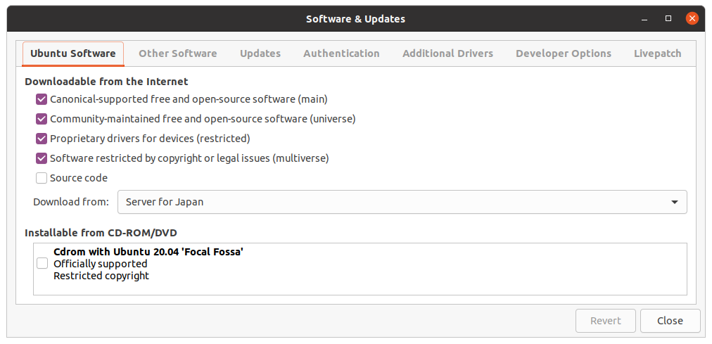
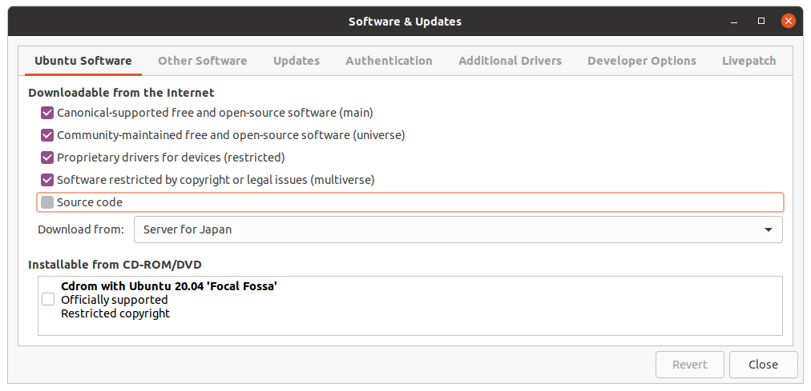
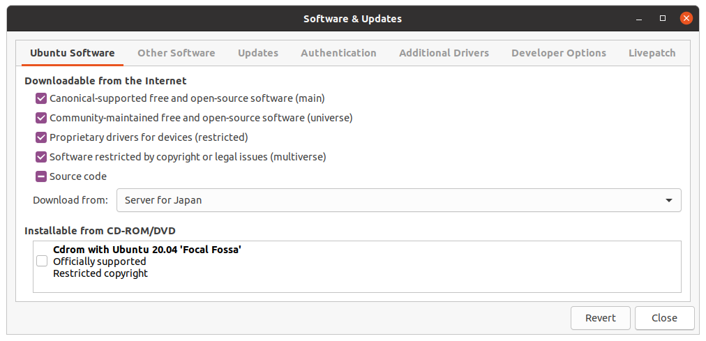
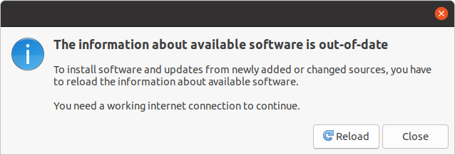

# リアルタイムカーネル構築
## 必要なファイルのダウンロード先
カーネル情報URL  
https://mirrors.edge.kernel.org/pub/linux/kernel  
パッチ情報URL  
https://mirrors.edge.kernel.org/pub/linux/kernel/projects/rt/
## カーネルのインストール
カーネルの保存先を確保し，必要なファイルを格納
```
mkdir ~/kernel
cd ~/kernel
```
カーネルバージョン５のものをダウンロード
```
wget https://mirrors.edge.kernel.org/pub/linux/kernel/v5.x/linux-5.4.78.tar.gz
```
カーネルバージョンに合ったパッチバージョンをダウンロード
```
https://mirrors.edge.kernel.org/pub/linux/kernel/projects/rt/5.4/older/patch-5.4.78-rt44.patch.gz
```
圧縮されたカーネルとパッチファイルを解凍
```
tar -xzf linux-5.4.78.tar.gz
gunzip patch-5.4.78-rt44.patch.gz
```
解凍したlinux-5.4.78に移動
```
cd linux-5.4.78
```
パッチの移動
```
patch -p1 < ../patch-5.4.78-rt44.patch
```
起動中のカーネルコンフィグファイルをコピー
```
cp /boot/config-5.4.0-54-generic .config
```

必要なパッケージファイルのインストール  

※インストール前にSourceCodeにチェックをつける必要がある  




Reloadを行ってウィンドウを閉じます

<p align='center'>
    
</p>

Source Codeの設定が終わったら必要パッケージをインストール 

```
sudo apt-get build-dep linux
sudo apt-get install libncurses-dev flex bison openssl libssl-dev dkms libelf-dev libudev-dev libpci-dev libiberty-dev autoconf fakeroot
```
コンフィグファイルのチェック
```
yes '' | make oldconfig
```
コンフィグメニューの起動
```
make menuconfig
```
選択すべき項目一覧
```
# Enable CONFIG_PREEMPT_RT
 -> General Setup
  -> Preemption Model (Fully Preemptible Kernel (Real-Time))
   (X) Fully Preemptible Kernel (Real-Time)

# Enable CONFIG_HIGH_RES_TIMERS
 -> General setup
  -> Timers subsystem
   [*] High Resolution Timer Support

# Enable CONFIG_NO_HZ_FULL
 -> General setup
  -> Timers subsystem
   -> Timer tick handling (Full dynticks system (tickless))
    (X) Full dynticks system (tickless)

# Set CONFIG_HZ_1000 (note: this is no longer in the General Setup menu, go back twice)
 -> Processor type and features
  -> Timer frequency (1000 HZ)
   (X) 1000 HZ

# Set CPU_FREQ_DEFAULT_GOV_PERFORMANCE [=y]
 ->  Power management and ACPI options
  -> CPU Frequency scaling
   -> CPU Frequency scaling (CPU_FREQ [=y])
    -> Default CPUFreq governor (<choice> [=y])
     (X) performance
```
カーネル構築のファイル作成
```
make -j `nproc` deb-pkg
```
カーネル構築ファイルのインストール
```
sudo dpkg -i ../*.deb
```
再起動
```
sudo reboot
```